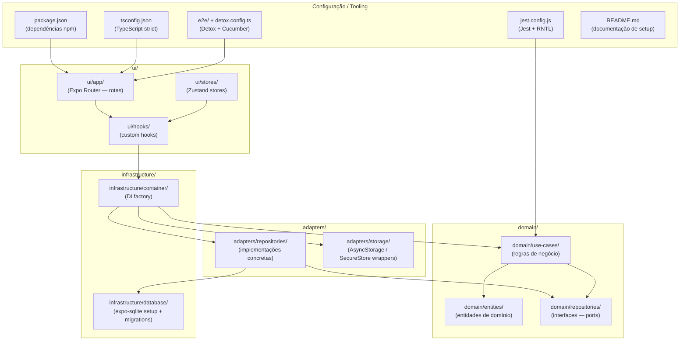
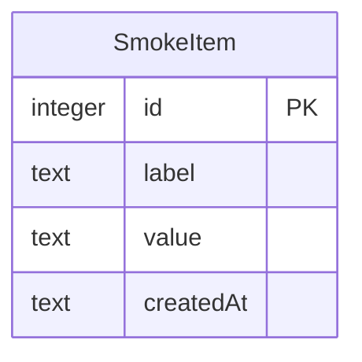
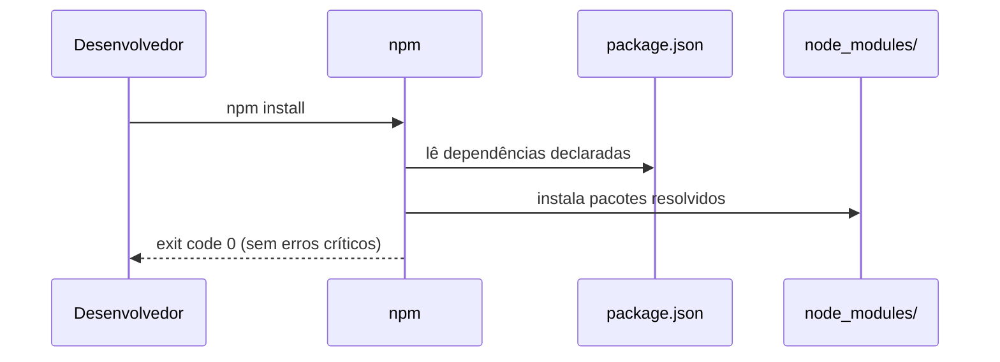
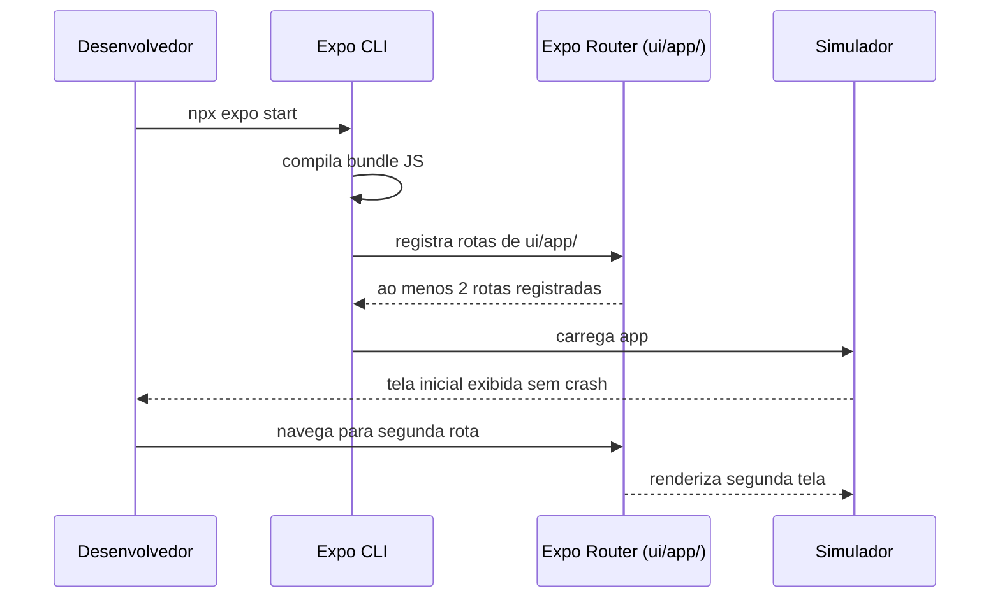
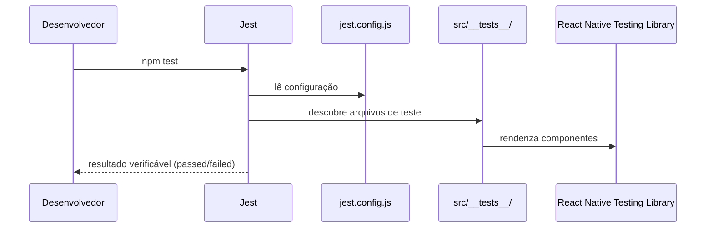
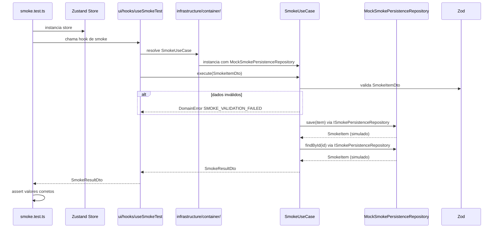
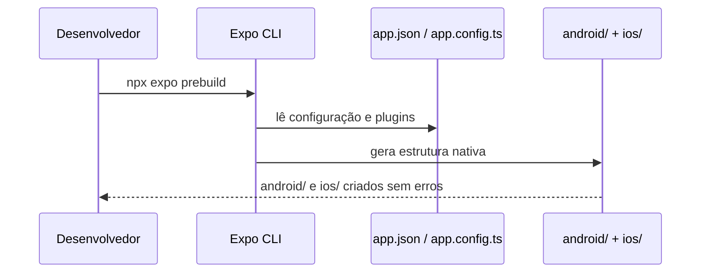
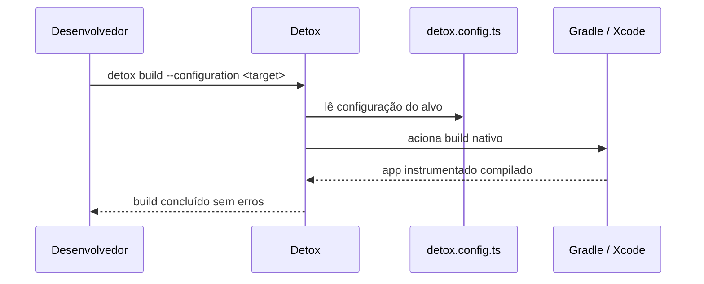

# Design — Setup do Projeto

## 1. Visão Geral Técnica

Esta feature estabelece a infraestrutura técnica do projeto seguindo a arquitetura hexagonal (Ports & Adapters). A abordagem consiste em configurar e validar o stack completo — Expo Router (file-based routing), Zustand (estado), Zod (validação), expo-sqlite (persistência relacional), expo-secure-store (dados sensíveis), Jest + React Native Testing Library (testes unitários) e Detox + @cucumber/cucumber (testes E2E) — garantindo que todos os toolings sejam exercitados por um teste smoke antes que qualquer feature de produto seja iniciada. Nenhum dado trafega fora do dispositivo; não há integração com serviços remotos, em conformidade com a regra "no data leaves the device" da `constitution.md`.

---

## 2. Arquitetura de Componentes

### package.json
- **Camada:** Configuração
- **Responsabilidade:** Declarar e versionar todas as dependências do projeto (Expo, TypeScript, NativeWind, Zustand, Zod, Jest, Detox, ESLint, Prettier). Ponto de entrada de `npm install`. (REQ-1, NFR-1)
- **Dependências:** nenhuma — é a raiz

### tsconfig.json
- **Camada:** Configuração
- **Responsabilidade:** Habilitar TypeScript strict mode em todos os arquivos `src/`. Garante que nenhuma build passe com erros de tipo. (REQ-8, NFR-3)
- **Dependências:** TypeScript (devDependency)

### ui/app/
- **Camada:** UI (Expo Router)
- **Responsabilidade:** Definir ao menos duas rotas via file-based routing (ex: `index.tsx` e uma segunda rota). Ponto de entrada do app no simulador. (REQ-2, REQ-3, NFR-2)
- **Dependências:** expo-router, ui/hooks/, ui/stores/

### ui/stores/
- **Camada:** UI — estado global
- **Responsabilidade:** Hospedar exemplo de Zustand store utilizado no smoke test (REQ-5). Mutações somente via hooks, nunca acesso direto a adapters (constitution regra 6).
- **Dependências:** Zustand, ui/hooks/

### ui/hooks/
- **Camada:** UI — ponte
- **Responsabilidade:** Expor casos de uso e estado aos componentes via custom hooks. Único ponto de acesso a `infrastructure/container/` a partir da UI (constitution regras 7, 21). (REQ-5)
- **Dependências:** infrastructure/container/

### infrastructure/container/
- **Camada:** Infraestrutura — DI
- **Responsabilidade:** Instanciar e conectar adaptadores concretos às interfaces de port. Único lugar onde dependências concretas são montadas (constitution regra 21). (REQ-5)
- **Dependências:** adapters/repositories/, adapters/storage/, domain/use-cases/

### infrastructure/database/
- **Camada:** Infraestrutura — persistência
- **Responsabilidade:** Inicializar expo-sqlite, executar migrations e expor a instância de banco ao repositório. (REQ-5, constitution regra 8)
- **Dependências:** expo-sqlite

### adapters/repositories/
- **Camada:** Adaptadores
- **Responsabilidade:** Implementar as interfaces de port definidas em `domain/repositories/`. Toda operação de SQLite ou AsyncStorage passa por aqui (constitution regras 5, 8, 15). (REQ-5)
- **Dependências:** domain/repositories/ (ports), infrastructure/database/

### adapters/storage/
- **Camada:** Adaptadores
- **Responsabilidade:** Encapsular AsyncStorage e expo-secure-store em wrappers tipados, impedindo acesso direto de componentes ou stores. (constitution regras 7, 15)
- **Dependências:** AsyncStorage, expo-secure-store

### domain/entities/
- **Camada:** Domínio
- **Responsabilidade:** Definir entidades e value objects usados no smoke test, sem dependência de frameworks (constitution regra 17). (REQ-5)
- **Dependências:** zero (apenas Zod para validação — permitido pela constitution regra 1)

### domain/repositories/
- **Camada:** Domínio — ports
- **Responsabilidade:** Declarar interfaces `I`-prefixadas que os adaptadores devem implementar. Nenhuma implementação aqui (constitution regra 5). (REQ-5)
- **Dependências:** zero

### domain/use-cases/
- **Camada:** Domínio — regras de negócio
- **Responsabilidade:** Implementar o caso de uso do smoke test (inserir/ler dado), recebendo dependências exclusivamente por injeção de interfaces (constitution regra 2). (REQ-5)
- **Dependências:** domain/repositories/ (via injeção), domain/entities/

### jest.config.js + src/__tests__/
- **Camada:** Configuração / Testes
- **Responsabilidade:** Configurar Jest + React Native Testing Library e hospedar ao menos um teste de exemplo (REQ-4, NFR-5) e o smoke test completo (REQ-5).
- **Dependências:** Jest, React Native Testing Library, domain/use-cases/

### e2e/ + detox.config.ts
- **Camada:** Configuração — testes E2E
- **Responsabilidade:** Configurar Detox e @cucumber/cucumber para permitir `detox build` sem erros após `expo prebuild`. (REQ-6, REQ-7)
- **Dependências:** Detox, @cucumber/cucumber, projeto nativo gerado por `expo prebuild`

### README.md
- **Camada:** Documentação
- **Responsabilidade:** Documentar os 4 procedimentos obrigatórios: install, dev, testes unitários e testes E2E. (REQ-9, NFR-4)
- **Dependências:** nenhuma

---

## 3. Modelo de Dados

Esta feature define apenas o modelo mínimo para validar a integração expo-sqlite no smoke test (REQ-5). Features de produto definirão seus próprios modelos.

### SmokeItem

| Campo | Tipo | Descrição |
|---|---|---|
| id | INTEGER (PK, autoincrement) | Identificador único gerado pelo SQLite |
| label | TEXT (not null) | Nome descritivo do item de teste |
| value | TEXT (not null) | Valor armazenado, validado por Zod antes de persistir |
| createdAt | TEXT (ISO 8601, not null) | Timestamp de criação — derivado no momento da inserção |

Relações: nenhuma — entidade isolada de smoke test.

Validação Zod: schema aplicado sobre `label` e `value` antes de entrar na camada de domínio (constitution regra 3).

---

## 4. API / Contratos

Esta feature não expõe API HTTP. Os contratos são interfaces TypeScript internas que conectam as camadas da arquitetura hexagonal, conforme exigido pela constitution (regra 20).

### ISmokePersistenceRepository (port)

Interface em `domain/repositories/ISmokePersistenceRepository.ts`.

| Método | Entrada | Saída | Erro |
|---|---|---|---|
| save | SmokeItemDto | Promise\<SmokeItem\> | DomainError code `SMOKE_SAVE_FAILED` |
| findById | id: number | Promise\<SmokeItem \| null\> | DomainError code `SMOKE_READ_FAILED` |

### SmokeItemDto (DTO de entrada)

Arquivo: `application/dtos/SmokeItemDto.ts`. Validado por schema Zod antes de entrar no domínio (constitution regra 3).

| Campo | Tipo | Validação Zod |
|---|---|---|
| label | string | min(1), max(100) |
| value | string | min(1) |

### SmokeResultDto (DTO de saída)

Arquivo: `application/dtos/SmokeResultDto.ts`. Retornado pelo hook ao store/componente (constitution regra 20).

| Campo | Tipo | Descrição |
|---|---|---|
| id | number | ID gerado pelo SQLite |
| label | string | Label persistido |
| value | string | Value persistido |
| createdAt | string | ISO 8601 |

### Erros de domínio

Todos os erros seguem a estrutura obrigatória da constitution (regra 4): `{ code, message, context }`.

| code | message | context |
|---|---|---|
| SMOKE_SAVE_FAILED | Falha ao persistir SmokeItem | `{ label, value, cause }` |
| SMOKE_READ_FAILED | Falha ao ler SmokeItem | `{ id, cause }` |
| SMOKE_VALIDATION_FAILED | Dados inválidos no SmokeItemDto | `{ field, reason }` |

---

## 5. Fluxo de Execução

> Nota: `scenarios.feature` está vazio (feature puramente técnica/infraestrutural). Os fluxos são derivados dos requisitos funcionais e do PRD.

### Fluxo: Instalação de Dependências (REQ-1, NFR-1)

1. Desenvolvedor executa `npm install` na raiz do projeto
2. npm lê `package.json` e resolve o grafo de dependências
3. npm baixa e instala todos os pacotes declarados em `node_modules/`
4. npm reporta exit code 0 sem erros críticos

### Fluxo: Inicialização do App no Simulador (REQ-2, REQ-3, NFR-2)

1. Desenvolvedor executa `npx expo start`
2. Expo CLI compila o bundle JavaScript
3. Expo Router lê os arquivos de rota em `ui/app/` e registra ao menos 2 rotas
4. App é carregado no simulador iOS/Android
5. Tela inicial é exibida sem crash nos primeiros 5 segundos (NFR-2)
6. Desenvolvedor navega para a segunda rota — Expo Router processa a navegação

### Fluxo: Execução dos Testes Unitários (REQ-4, NFR-5)

1. Desenvolvedor executa `npm test`
2. Jest lê `jest.config.js` e descobre arquivos de teste em `src/__tests__/`
3. Jest executa ao menos 1 teste de exemplo com React Native Testing Library
4. Jest reporta resultado verificável (passed/failed) sem erros críticos

### Fluxo: Smoke Test — Store + Zod + SQLite (REQ-5)

1. Jest carrega `src/__tests__/smoke.test.ts`
2. `infrastructure/container/` instancia `SmokeSQLiteRepository` com conexão de `infrastructure/database/`
3. `infrastructure/container/` instancia `SmokeUseCase` injetando `ISmokePersistenceRepository`
4. Smoke test instancia Zustand store e despacha ação de criação
5. Hook chama `SmokeUseCase.execute(SmokeItemDto)` via container
6. `SmokeUseCase` valida `SmokeItemDto` via schema Zod — lança `DomainError SMOKE_VALIDATION_FAILED` se inválido
7. `SmokeUseCase` chama `ISmokePersistenceRepository.save(item)`
8. Mock de `ISmokePersistenceRepository` registra a chamada e retorna `SmokeItem` simulado (DT-3)
9. `SmokeUseCase` chama `ISmokePersistenceRepository.findById(id)` para leitura
10. Mock retorna o `SmokeItem` correspondente
11. `SmokeUseCase` mapeia para `SmokeResultDto` e retorna ao hook
12. Jest afirma que `SmokeResultDto` contém os valores inseridos — teste passa

### Fluxo: Geração do Projeto Nativo (REQ-6)

1. Desenvolvedor executa `npx expo prebuild`
2. Expo CLI lê `app.json`/`app.config.ts` e plugins nativos
3. Expo CLI gera as pastas `android/` e `ios/` com código nativo correspondente
4. Estrutura nativa gerada sem erros — habilita o passo de build E2E

### Fluxo: Build E2E com Detox (REQ-7)

1. Desenvolvedor executa `detox build --configuration <target>`
2. Detox lê `e2e/detox.config.ts` e identifica o alvo (android.emu.debug / ios.sim.debug)
3. Detox aciona o build nativo (Gradle / Xcode) usando projeto gerado por `expo prebuild`
4. Build compila o app instrumentado para E2E
5. Build conclui sem erros — app pronto para `detox test`

---

## 6. Decisões Técnicas

### DT-1: Smoke test via teste unitário Jest, não via renderização de componente

- **Problema:** REQ-5 exige validar 3 camadas (store + Zod + SQLite) em uma única execução. Essa validação pode ocorrer em nível de teste unitário Jest ou em nível de componente renderizado com RNTL.
- **Alternativas:**
  1. Teste unitário Jest puro — instancia diretamente use-case, repositório e store sem renderizar UI
  2. Teste de componente com RNTL — renderiza uma tela que dispara o fluxo completo
- **Decisão:** Alternativa 1 — teste unitário Jest.
- **Justificativa:** O smoke test valida a infraestrutura técnica (conexão de camadas), não comportamento de UI. Testes unitários são mais rápidos, isolados e não requerem ambiente nativo. Testes de componente dependem de renderer compatível com Expo em CI, introduzindo fragilidade desnecessária nesta etapa. (REQ-4, REQ-5, NFR-5)

### DT-2: Entidade `SmokeItem` dedicada como prova de conceito da arquitetura

- **Problema:** O smoke test precisa de uma entidade que percorra todas as camadas. Pode-se criar uma entidade dedicada ou usar um tipo genérico ad-hoc sem passar pelo domínio.
- **Alternativas:**
  1. Entidade `SmokeItem` em `domain/entities/` com port e adaptador completos
  2. Tipo genérico ad-hoc apenas no adaptador, sem passar pelo domínio
- **Decisão:** Alternativa 1 — entidade `SmokeItem` dedicada.
- **Justificativa:** O objetivo do setup é validar que a arquitetura hexagonal está corretamente configurada end-to-end. Um tipo ad-hoc não exercitaria os ports, a injeção de dependência nem o container — tornando o smoke test uma validação superficial que não cumpre REQ-5. (REQ-5, constitution regras 2, 5, 21)

### DT-3: Mock do repositório no smoke test Jest, SQLite real nos testes E2E

- **Problema:** O smoke test de SQLite pode usar a instância real de expo-sqlite ou um mock para isolar o teste do ambiente nativo.
- **Alternativas:**
  1. expo-sqlite em modo arquivo real no Jest — teste roda contra banco local do simulador
  2. Mock do repositório `ISmokePersistenceRepository` em `src/__mocks__/`
  3. SQLite in-memory via `:memory:` (se suportado pelo driver em ambiente Jest)
- **Decisão:** Alternativa 2 — mock do port em `src/__mocks__/`.
- **Justificativa:** Jest roda em ambiente Node.js sem acesso ao sistema de arquivos nativo do simulador; expo-sqlite não é compatível com Jest sem bridge nativa. Mockar o port (não o adaptador) valida a integração store + Zod + use-case sem dependência de ambiente nativo. A integração real com SQLite é responsabilidade dos testes E2E Detox. (REQ-5, NFR-5, constitution regra 2)

### DT-4: Documentação de setup centralizada no README.md

- **Problema:** As instruções de setup podem estar no README.md, em `docs/SETUP.md` separado ou dispersas em comentários de código.
- **Alternativas:**
  1. README.md na raiz — único arquivo, descoberta imediata por novos desenvolvedores
  2. Arquivo `docs/SETUP.md` separado — mantém README.md enxuto
- **Decisão:** Alternativa 1 — README.md na raiz.
- **Justificativa:** PRD (Objetivo 8) e NFR-4 especificam explicitamente o README.md. É o primeiro arquivo lido ao clonar o repositório (PRD Fluxo Principal passo B). Não há ganho em separar quando o conteúdo é estritamente de setup e o PRD é explícito sobre o artefato esperado. (REQ-9, NFR-4)
