# PRD — Setup do Projeto

## 1. Visão Geral

Setup completo de um projeto React Native + Expo que permite aos desenvolvedores iniciar o desenvolvimento local do aplicativo (rodar em modo desenvolvimento no simulador) e configurar toda a infraestrutura necessária para testes E2E com Detox e Cucumber, garantindo que o ambiente de desenvolvimento e testes esteja pronto para uso imediato.

## 2. Problema

Atualmente, desenvolvedores que querem iniciar o trabalho no aplicativo kmbr-expo enfrentam uma barreira significativa: não existe um guia estruturado ou infraestrutura pré-configurada que permita começar o desenvolvimento imediatamente. Sem setup centralizado, cada desenvolvedor precisa descobrir manualmente quais dependências instalar, como configurar o Expo Router, Zustand, SQLite local, e como preparar o ambiente para rodar testes E2E com Detox e Cucumber. Isso resulta em inconsistências (diferentes versões de dependências, configurações divergentes), perda de tempo em atividades não essenciais, e aumento do risco de erros de configuração que prejudicam a qualidade inicial do código.

Além disso, sem esse setup consolidado, qualquer novo desenvolvedor que entre no projeto terá curva de aprendizado mais longa, e features futuras correm o risco de não seguir a arquitetura hexagonal e as convenções estabelecidas no CLAUDE.md.

## 3. Usuário-Alvo

Desenvolvedores (full-stack ou frontend-focused) que trabalham no projeto kmbr-expo ou pretendem começar. Pressupõe-se conhecimento básico de Node.js, npm/yarn e JavaScript/TypeScript, mas pode não ter experiência prévia com React Native, Expo, Detox ou com a arquitetura hexagonal deste projeto.

## 4. Objetivos

1. Instalar e configurar todas as dependências npm (Expo, TypeScript, NativeWind, Zustand, Zod, Jest, ESLint, Prettier)
2. Configurar o Expo Router para navegação file-based
3. Configurar Zustand e Zod para estado e validação
4. Configurar expo-sqlite e expo-secure-store para persistência local
5. Configurar Jest + React Native Testing Library para testes unitários
6. Configurar Detox + @cucumber/cucumber para testes E2E
7. Permitir rodar o app em modo desenvolvimento no simulador (tela inicial, mesmo que em branco)
8. Documentar o setup no README.md com instruções passo-a-passo

## 5. Critérios de Sucesso

| Critério | Medida |
|---|---|
| Dependências instaladas sem erros | `npm install` executa sem erros críticos |
| App roda em desenvolvimento | Simulador iOS/Android inicia sem crash |
| Rotas configuradas e funcionais | Expo Router reconhece e navega entre pelo menos 2 rotas |
| Jest e React Native Testing Library funcionam | `npm test` passa em pelo menos 1 teste de exemplo |
| Detox compilável | `detox build` completa sem erros |
| TypeScript validado | `npx tsc --noEmit` sem erros de tipo |
| Documentação atualizada | README.md inclui instruções de install, dev, test, e2e |
| Teste smoke funcional | Exemplo que instancia Zustand store + valida com Zod + insere/lê dado em SQLite |

## 6. Fora do Escopo

- Implementação de features funcionais do aplicativo (telas, lógica de negócio).
- Configuração e setup de CI/CD (GitHub Actions, deployments automáticos).
- Documentação de padrões de arquitetura hexagonal (já documentada em CLAUDE.md).
- Deploy ou build para produção (EAS Build).
- Integração com serviços remotos ou APIs externas.
- Setup de variáveis de ambiente (.env) para produção.

## 7. Fluxo Principal

```mermaid
flowchart LR
    A["Dev clona o repositório"] --> B["Lê README.md e CLAUDE.md"]
    B --> C["Executa npm install"]
    C --> D["Executa npx expo start"]
    D --> E["Simulador abre com app rodando"]
    E --> F["Executa npm test"]
    F --> G["Jest + RNTL passam com sucesso"]
    G --> H["Executa npx expo prebuild"]
    H --> I["Estrutura nativa gerada sem erros"]
    I --> J["Executa detox build"]
    J --> K["App compilado para E2E"]
    K --> L["Ambiente pronto para desenvolvimento"]
```

Cada passo desta sequência é executado uma única vez no início do setup. Após L, o desenvolvedor está apto a criar e testar features seguindo a arquitetura hexagonal.

## 8. Fluxo Alternativo

Não se aplica. O setup é linear e sem bifurcações: cada desenvolvedor segue exatamente o mesmo caminho (install → start → test → prebuild → detox build). Erros ou variações de ambiente são tratados como problemas de execução (ajustes locais ou documentação do README), não como fluxos alternativos de produto.
