# Tasks — Setup do Projeto

## REQ-1 — Instalação de Dependências

> When a developer runs the dependency installation command, the system shall install all required packages without critical errors, making the project ready for the next setup step.

### T-01: Declarar todas as dependências no package.json

- [ ] Adicionar ao `package.json` todas as dependências requeridas pelo projeto: Expo SDK, expo-router, TypeScript, NativeWind, Zustand, Zod, expo-sqlite, expo-secure-store, AsyncStorage, Jest, React Native Testing Library, Detox, @cucumber/cucumber, ESLint e Prettier. Garantir que versões sejam compatíveis entre si e com o Expo SDK escolhido.

**Rastreabilidade:** REQ-1 · NFR-1
**Depende de:** —
**Concluída quando:** `npm install` completa com exit code 0, sem erros críticos, e `node_modules/` contém todos os pacotes declarados.

---

## REQ-2 — Inicialização do App no Simulador

> When a developer starts the application in development mode, the system shall launch the app on the simulator without crashes, displaying at least an initial screen.

### T-02: Criar estrutura base do Expo Router em ui/app/

- [ ] Criar o diretório `src/ui/app/` com ao menos dois arquivos de rota usando file-based routing do Expo Router: `index.tsx` como tela inicial e uma segunda rota (ex: `about.tsx`). Cada tela deve renderizar um componente React Native simples sem lógica de negócio.

**Rastreabilidade:** REQ-2 · REQ-3 · NFR-2
**Depende de:** T-01
**Concluída quando:** `npx expo start` carrega o app no simulador iOS ou Android, exibe a tela inicial sem crash nos primeiros 5 segundos, e a navegação para a segunda rota funciona via Expo Router.

### T-03: Configurar app.json / app.config.ts

- [ ] Criar ou ajustar `app.json` (ou `app.config.ts`) com os metadados obrigatórios do Expo: `name`, `slug`, `version`, `ios.bundleIdentifier`, `android.package` e plugins necessários (NativeWind, expo-router). Configurar `scheme` para deep linking compatível com Expo Router.

**Rastreabilidade:** REQ-2 · REQ-6
**Depende de:** T-01
**Concluída quando:** `npx expo start` não reporta erro de configuração e `expo prebuild` lê o arquivo sem falhas.

---

## REQ-3 — Navegação entre Rotas

> When the application starts, the system shall recognize and navigate between at least two configured routes using file-based routing.

### T-04: Implementar layout raiz do Expo Router

- [ ] Criar `src/ui/app/_layout.tsx` com o componente `Stack` ou `Tabs` do Expo Router que registra as rotas disponíveis. Garantir que ao menos duas rotas sejam reconhecidas e navegáveis. Não incluir lógica de negócio no layout.

**Rastreabilidade:** REQ-3
**Depende de:** T-02
**Concluída quando:** Expo Router registra ao menos 2 rotas sem erro de roteamento, e a navegação entre elas renderiza as telas corretas no simulador.

---

## REQ-4 — Execução da Suite de Testes Unitários

> When a developer runs the unit test suite, the system shall execute at least one example test and report a passing result without errors.

### T-05: Configurar Jest e React Native Testing Library

- [ ] Criar `jest.config.js` (ou `jest.config.ts`) na raiz do projeto configurando preset compatível com Expo, transformers necessários para TypeScript e JSX, e `moduleNameMapper` para aliases de `src/`. Adicionar script `"test": "jest"` no `package.json`.

**Rastreabilidade:** REQ-4 · NFR-5
**Depende de:** T-01
**Concluída quando:** `npm test` executa sem erros críticos e reporta resultado (passed/failed) verificável no terminal.

### T-06: Criar diretório de mocks em src/__mocks__/

- [ ] Criar o diretório `src/__mocks__/` e adicionar o mock de `ISmokePersistenceRepository` como arquivo TypeScript. O mock deve implementar a interface do port com `save()` e `findById()` retornando valores configuráveis via jest.fn().

**Rastreabilidade:** REQ-4 · REQ-5
**Depende de:** T-05 · T-14
**Concluída quando:** O mock é importável nos testes unitários e permite configurar retornos distintos por teste sem compartilhar estado.

---

## REQ-5 — Smoke Test: Store + Zod + SQLite

> When the smoke test is executed, the system shall successfully instantiate a state store, validate data using a schema validator, and perform a write-then-read cycle on the local database, all within the same test run.

### T-07: Criar entidade SmokeItem em domain/entities/

- [ ] Criar `src/domain/entities/SmokeItem.ts` definindo o tipo `SmokeItem` com campos `id: number`, `label: string`, `value: string` e `createdAt: string`. A entidade não deve importar nada de fora de `domain/` exceto Zod (se necessário para validação interna).

**Rastreabilidade:** REQ-5
**Depende de:** —
**Concluída quando:** O tipo `SmokeItem` é importável de `domain/entities/` e satisfaz `strict: true` do TypeScript sem erros.

### T-08: Declarar interface ISmokePersistenceRepository em domain/repositories/

- [ ] Criar `src/domain/repositories/ISmokePersistenceRepository.ts` com a interface `ISmokePersistenceRepository` contendo os métodos `save(dto: SmokeItemDto): Promise<SmokeItem>` e `findById(id: number): Promise<SmokeItem | null>`. Nenhuma implementação neste arquivo — apenas a interface (port).

**Rastreabilidade:** REQ-5
**Depende de:** T-07
**Concluída quando:** A interface é exportada de `domain/repositories/` e os adaptadores podem implementá-la sem erros de tipo.

### T-09: Criar SmokeItemDto em application/dtos/

- [ ] Criar `src/application/dtos/SmokeItemDto.ts` com o tipo `SmokeItemDto` contendo `label: string` e `value: string`. Criar também `SmokeResultDto.ts` com `id: number`, `label: string`, `value: string` e `createdAt: string`. Ambos os arquivos devem estar em `src/application/dtos/`.

**Rastreabilidade:** REQ-5
**Depende de:** —
**Concluída quando:** Os DTOs são importáveis e compilam sem erros com `strict: true`.

### T-10: Criar schema Zod para SmokeItemDto

- [ ] Criar o schema Zod para validar `SmokeItemDto` em `src/application/dtos/SmokeItemDto.ts` (ou arquivo dedicado `smoke-item-dto.schema.ts`). O schema deve aplicar: `label` com `min(1)` e `max(100)`; `value` com `min(1)`. Erros de validação devem ser mapeáveis para `DomainError` com `code: "SMOKE_VALIDATION_FAILED"`.

**Rastreabilidade:** REQ-5
**Depende de:** T-09
**Concluída quando:** O schema rejeita `label` vazio, `label` com 101+ caracteres, `value` vazio e tipos incorretos; e aceita inputs válidos — todos verificáveis sem mock.

### T-11: Definir estrutura de DomainError

- [ ] Criar `src/domain/entities/DomainError.ts` (ou `src/domain/errors/DomainError.ts`) com a classe ou tipo `DomainError` contendo os campos obrigatórios `code: string`, `message: string` e `context: Record<string, unknown>`. Deve estender `Error` para ser compatível com `throw`.

**Rastreabilidade:** REQ-5
**Depende de:** —
**Concluída quando:** `DomainError` é instanciável com os três campos, pode ser lançado com `throw` e capturado em `catch (e)` com narrowing de tipo correto.

### T-12: Implementar SmokeUseCase em domain/use-cases/

- [ ] Criar `src/domain/use-cases/SmokeUseCase.ts` com a classe `SmokeUseCase` que recebe `ISmokePersistenceRepository` por injeção de dependência no construtor. Implementar o método `execute(dto: SmokeItemDto): Promise<SmokeResultDto>` que: valida o DTO via schema Zod lançando `DomainError SMOKE_VALIDATION_FAILED` se inválido; chama `repository.save()` capturando erros e relançando como `DomainError SMOKE_SAVE_FAILED`; chama `repository.findById()` capturando erros e relançando como `DomainError SMOKE_READ_FAILED`; e mapeia o resultado para `SmokeResultDto`.

**Rastreabilidade:** REQ-5
**Depende de:** T-07 · T-08 · T-09 · T-10 · T-11
**Concluída quando:** O caso de uso é instanciável com qualquer implementação de `ISmokePersistenceRepository` e compila sem erros. A lógica de validação e mapeamento de erros está completa.

### T-13: Criar migration da tabela SmokeItem em infrastructure/database/

- [ ] Criar `src/infrastructure/database/migrations/001-create-smoke-item.ts` (ou equivalente) com o SQL de criação da tabela `SmokeItem` com colunas `id INTEGER PRIMARY KEY AUTOINCREMENT`, `label TEXT NOT NULL`, `value TEXT NOT NULL`, `createdAt TEXT NOT NULL`. O script deve ser idempotente (`CREATE TABLE IF NOT EXISTS`).

**Rastreabilidade:** REQ-5
**Depende de:** —
**Concluída quando:** A migration cria a tabela corretamente na primeira execução e não lança erro em execuções subsequentes no mesmo banco.

### T-14: Configurar inicialização do expo-sqlite em infrastructure/database/

- [ ] Criar `src/infrastructure/database/database.ts` responsável por abrir a conexão expo-sqlite e executar as migrations em sequência. Expor a instância de banco tipada para uso pelos repositórios. O módulo não deve ser importado diretamente por componentes ou stores.

**Rastreabilidade:** REQ-5
**Depende de:** T-13
**Concluída quando:** O módulo exporta a instância de banco inicializada após execução das migrations, sem erros de tipo ou runtime quando chamado pelo container.

### T-15: Implementar SmokeSQLiteRepository em adapters/repositories/

- [ ] Criar `src/adapters/repositories/SmokeSQLiteRepository.ts` implementando `ISmokePersistenceRepository`. O método `save()` deve inserir o item no SQLite, ler o `lastInsertRowId` e retornar o `SmokeItem` completo incluindo `createdAt` em ISO 8601. O método `findById()` deve fazer query por `id` e retornar `SmokeItem` ou `null`.

**Rastreabilidade:** REQ-5
**Depende de:** T-08 · T-14
**Concluída quando:** O repositório compila sem erros, implementa todos os métodos da interface `ISmokePersistenceRepository` e não importa nada de `domain/use-cases/` ou `ui/`.

### T-16: Criar wrappers de AsyncStorage e SecureStore em adapters/storage/

- [ ] Criar `src/adapters/storage/AsyncStorageService.ts` e `src/adapters/storage/SecureStorageService.ts` encapsulando AsyncStorage e expo-secure-store respectivamente em interfaces tipadas. Cada wrapper deve expor métodos `get(key)`, `set(key, value)` e `delete(key)` sem vazar a API nativa para fora do adaptador.

**Rastreabilidade:** REQ-5
**Depende de:** T-01
**Concluída quando:** Os wrappers são importáveis de `adapters/storage/`, compilam sem erros, e nenhum componente ou store precisa importar AsyncStorage ou expo-secure-store diretamente.

### T-17: Configurar container de injeção de dependência em infrastructure/container/

- [ ] Criar `src/infrastructure/container/index.ts` (ou `container.ts`) como factory manual que instancia `SmokeSQLiteRepository` com a conexão de `infrastructure/database/` e injeta-o no `SmokeUseCase`. Deve ser o único ponto onde dependências concretas são montadas. Exportar função ou objeto de acesso ao `SmokeUseCase` resolvido.

**Rastreabilidade:** REQ-5
**Depende de:** T-12 · T-15
**Concluída quando:** O container resolve `SmokeUseCase` com `SmokeSQLiteRepository` real sem que `ui/` precise importar adaptadores diretamente.

### T-18: Criar Zustand store de exemplo em ui/stores/

- [ ] Criar `src/ui/stores/useSmokeStore.ts` com um Zustand store simples que mantém o estado do resultado do smoke test (`status: "idle" | "loading" | "success" | "error"` e `result: SmokeResultDto | null`). Mutações somente via ações do store, sem acesso direto a adaptadores.

**Rastreabilidade:** REQ-5
**Depende de:** T-09
**Concluída quando:** O store é importável, compila com `strict: true` e expõe ações para atualizar o estado sem acessar SQLite ou AsyncStorage diretamente.

### T-19: Criar custom hook useSmokeTest em ui/hooks/

- [ ] Criar `src/ui/hooks/useSmokeTest.ts` que usa o container para resolver `SmokeUseCase` e expõe uma função `runSmoke(dto: SmokeItemDto)` ao componente. O hook deve atualizar o `useSmokeStore` com o resultado ou erro. É o único ponto de acesso a `infrastructure/container/` a partir da UI.

**Rastreabilidade:** REQ-5
**Depende de:** T-17 · T-18
**Concluída quando:** O hook é utilizável em componentes sem que o componente importe container, repositório ou use-case diretamente.

### T-20: Configurar TypeScript strict mode em tsconfig.json

- [ ] Criar ou ajustar `tsconfig.json` na raiz do projeto com `"strict": true` habilitado e paths configurados para os aliases de `src/` (ex: `@domain/*`, `@adapters/*`, `@ui/*`). Garantir que todos os arquivos de `src/` sejam cobertos pela verificação de tipos.

**Rastreabilidade:** REQ-5 · REQ-8 · NFR-3
**Depende de:** T-01
**Concluída quando:** `npx tsc --noEmit` executa sem erros de tipo em todos os arquivos de `src/`.

### T-21: Cobrir SmokeUseCase.execute() — caminho feliz (UT-1)

- [ ] Escrever teste unitário Jest para `SmokeUseCase.execute()` com dados válidos. O teste deve instanciar o use-case com mock de `ISmokePersistenceRepository`, chamar `execute({ label: "test", value: "val" })` e afirmar que o `SmokeResultDto` retornado contém os valores corretos em todos os campos (`id`, `label`, `value`, `createdAt`).

**Rastreabilidade:** REQ-5 · UT-1
**Depende de:** T-06 · T-12
**Concluída quando:** O teste passa em `npm test` com mock configurado para `save()` e `findById()` retornando item simulado.

### T-22: Cobrir SmokeUseCase.execute() — validação Zod: label vazio (UT-2)

- [ ] Escrever teste unitário Jest que chama `SmokeUseCase.execute({ label: "", value: "val" })` e afirma que uma `DomainError` com `code: "SMOKE_VALIDATION_FAILED"` e `context.field: "label"` é lançada. Verificar que `save()` do mock não é chamado.

**Rastreabilidade:** REQ-5 · UT-2
**Depende de:** T-06 · T-12
**Concluída quando:** O teste passa, `save()` não é invocado (verificado via `expect(mockSave).not.toHaveBeenCalled()`), e o código do erro é correto.

### T-23: Cobrir SmokeUseCase.execute() — validação Zod: value vazio (UT-3)

- [ ] Escrever teste unitário Jest que chama `SmokeUseCase.execute({ label: "ok", value: "" })` e afirma que `DomainError` com `code: "SMOKE_VALIDATION_FAILED"` e `context.field: "value"` é lançada. Verificar que `save()` não é chamado.

**Rastreabilidade:** REQ-5 · UT-3
**Depende de:** T-06 · T-12
**Concluída quando:** O teste passa com as mesmas verificações de UT-2 aplicadas ao campo `value`.

### T-24: Cobrir SmokeUseCase.execute() — validação Zod: label excede max(100) (UT-4)

- [ ] Escrever teste unitário Jest que chama `SmokeUseCase.execute()` com `label` contendo 101 caracteres e afirma que `DomainError` com `code: "SMOKE_VALIDATION_FAILED"` é lançada. `save()` não deve ser chamado.

**Rastreabilidade:** REQ-5 · UT-4
**Depende de:** T-06 · T-12
**Concluída quando:** O teste passa com `label` de 101 chars e falha (como esperado) ao usar `label` de 100 chars com `value` válido.

### T-25: Cobrir SmokeUseCase.execute() — falha no save() (UT-5)

- [ ] Escrever teste unitário Jest onde o mock de `save()` lança um erro genérico. Afirmar que `SmokeUseCase` relança como `DomainError` com `code: "SMOKE_SAVE_FAILED"` contendo `context.cause`. Verificar que o erro não é silenciado.

**Rastreabilidade:** REQ-5 · UT-5
**Depende de:** T-06 · T-12
**Concluída quando:** O teste passa com mock de `save()` configurado para lançar, e o `DomainError` capturado tem o `code` e `context.cause` corretos.

### T-26: Cobrir SmokeUseCase.execute() — falha no findById() (UT-6)

- [ ] Escrever teste unitário Jest onde `save()` retorna item simulado e `findById()` lança erro. Afirmar que `SmokeUseCase` relança como `DomainError` com `code: "SMOKE_READ_FAILED"` contendo `context.id` e `context.cause`.

**Rastreabilidade:** REQ-5 · UT-6
**Depende de:** T-06 · T-12
**Concluída quando:** O teste passa com `findById()` configurado para lançar após `save()` bem-sucedido.

### T-27: Cobrir SmokeUseCase.execute() — findById() retorna null (UT-7)

- [ ] Escrever teste unitário Jest onde `findById()` retorna `null` após `save()` bem-sucedido. Afirmar que o `SmokeUseCase` trata a ausência de retorno de forma explícita — seja lançando `DomainError` ou retornando valor nulo mapeado — conforme contrato definido no design.

**Rastreabilidade:** REQ-5 · UT-7
**Depende de:** T-06 · T-12
**Concluída quando:** O teste passa e o comportamento diante de `null` é determinístico e documentado via comentário no teste.

### T-28: Cobrir SmokeItemDto — conformidade com schema Zod (UT-8)

- [ ] Escrever teste unitário Jest que exercita o schema Zod de `SmokeItemDto` diretamente, sem instanciar o use-case. Testar: `label: 123` falha; `value: null` falha; input válido (`label: "ok", value: "x"`) é aceito pelo `parse()`.

**Rastreabilidade:** REQ-5 · UT-8
**Depende de:** T-10
**Concluída quando:** Os três casos passam sem mock, exercitando o schema Zod isolado.

### T-29: Cobrir SmokeSQLiteRepository.save() com SQLite real (IT-1)

- [ ] Escrever teste de integração Jest para `SmokeSQLiteRepository.save()` usando expo-sqlite em banco de teste (`:memory:` ou arquivo temporário). Afirmar que `save()` retorna `SmokeItem` com `id` numérico gerado e que `findById(id)` após o `save()` retorna o mesmo item.

**Rastreabilidade:** REQ-5 · NFR-1 · IT-1
**Depende de:** T-15
**Concluída quando:** O teste passa com banco real, tabela limpa antes de cada execução, e todos os campos do `SmokeItem` retornado são verificados.

### T-30: Cobrir SmokeSQLiteRepository.findById() com SQLite real (IT-2)

- [ ] Escrever teste de integração Jest para `SmokeSQLiteRepository.findById()` com banco real. Testar: `findById(id)` com ID existente retorna item correto; `findById(999)` com ID inexistente retorna `null`.

**Rastreabilidade:** REQ-5 · IT-2
**Depende de:** T-15
**Concluída quando:** Os dois casos passam com banco de teste pré-populado via SQL direto para o caso do ID existente.

### T-31: Cobrir infrastructure/database/ — inicialização e idempotência de migration (IT-3)

- [ ] Escrever teste de integração Jest que inicializa o módulo `infrastructure/database/` duas vezes no mesmo banco de teste. Afirmar que: a tabela `SmokeItem` é criada na primeira execução com as colunas corretas (verificadas via `PRAGMA table_info`); a segunda execução não lança erro.

**Rastreabilidade:** REQ-5 · NFR-1 · IT-3
**Depende de:** T-14
**Concluída quando:** O teste passa com banco limpo e dois ciclos de inicialização consecutivos sem erro.

### T-32: Cobrir infrastructure/container/ — resolução de dependências (IT-6)

- [ ] Escrever teste de integração Jest que resolve `SmokeUseCase` via container real (sem mock) apontando para banco de teste. Chamar `execute(dto)` e afirmar que `SmokeResultDto` retornado contém os dados corretos. Verificar que o container não instancia use-case diretamente em componente (regra 21 da constitution).

**Rastreabilidade:** REQ-5 · IT-6
**Depende de:** T-17
**Concluída quando:** O teste passa com container real e banco de teste, sem mock de repositório.

---

## REQ-6 — Geração do Projeto Nativo

> When a developer runs the native project generation command, the system shall generate the native project structure without errors, enabling the E2E build step.

### T-33: Validar geração do projeto nativo via expo prebuild

- [ ] Garantir que `app.json` (ou `app.config.ts`) está corretamente configurado para que `npx expo prebuild` gere as pastas `android/` e `ios/` sem erros. Documentar no README.md o comando e pré-requisitos (Node.js, ferramentas nativas). Verificar que o `.gitignore` exclui `android/` e `ios/` (gerados — não versionados).

**Rastreabilidade:** REQ-6
**Depende de:** T-03
**Concluída quando:** `npx expo prebuild` executa com exit code 0, gera `android/` e `ios/`, e as pastas não são rastreadas pelo git.

---

## REQ-7 — Build E2E com Detox

> When a developer runs the E2E build command, the system shall compile the application for end-to-end testing without errors.

### T-34: Configurar Detox e @cucumber/cucumber para E2E

- [ ] Criar `e2e/detox.config.ts` com configurações para ao menos dois alvos: `android.emu.debug` e `ios.sim.debug`. Criar estrutura de diretórios `e2e/features/`, `e2e/step-definitions/` e `e2e/support/`. Configurar `@cucumber/cucumber` como runner de steps. Garantir que `detox build --configuration <target>` compila sem erros após `expo prebuild`.

**Rastreabilidade:** REQ-7
**Depende de:** T-33
**Concluída quando:** `detox build --configuration android.emu.debug` e `detox build --configuration ios.sim.debug` completam sem erros críticos após `expo prebuild`.

---

## REQ-8 — Verificação de Tipos Estática

> The system shall pass static type checking across all source files without type errors.

### T-35: Verificar ausência de any e conformidade com strict mode

- [ ] Configurar a regra ESLint `@typescript-eslint/no-explicit-any` como `error` no arquivo `.eslintrc.js` (ou `eslint.config.js`). Garantir que `npx tsc --noEmit` com `strict: true` passa sem erros. Configurar scripts no `package.json`: `"lint": "eslint src --ext .ts,.tsx"` e `"typecheck": "tsc --noEmit"`.

**Rastreabilidade:** REQ-8 · NFR-3
**Depende de:** T-20
**Concluída quando:** `npm run typecheck` e `npm run lint` executam sem reportar erros de tipo ou ocorrências de `any` explícito em `src/`.

---

## REQ-9 — Documentação de Setup

> The system shall provide a documentation file containing step-by-step instructions for dependency installation, running the app in development mode, executing unit tests, and running E2E tests.

### T-36: Criar README.md com os 4 procedimentos obrigatórios

- [ ] Criar `README.md` na raiz do projeto documentando com exemplos de comandos os 4 procedimentos: (1) instalação de dependências (`npm install`); (2) execução em desenvolvimento (`npx expo start`); (3) testes unitários (`npm test`); (4) testes E2E (`expo prebuild` → `detox build` → `detox test`). Incluir pré-requisitos de ambiente (Node.js, simulador, etc.).

**Rastreabilidade:** REQ-9 · NFR-4
**Depende de:** —
**Concluída quando:** O README.md contém os 4 procedimentos com comandos executáveis e pré-requisitos claros, verificável por qualquer desenvolvedor ao clonar o repositório.

---

## NFRs sem REQ direto

### T-37: Cobrir adapters/storage/SecureStorageService — leitura e escrita (IT-4)

- [ ] Escrever teste de integração para o wrapper de `expo-secure-store`. Testar: `set(key, value)` seguido de `get(key)` retorna o valor armazenado; `get(key)` com chave inexistente retorna `null`; `delete(key)` seguido de `get(key)` retorna `null`. Limpar o keychain antes de cada teste.

**Rastreabilidade:** NFR-1 · IT-4
**Depende de:** T-16
**Concluída quando:** Os três casos passam com wrapper real, sem acesso direto a `expo-secure-store` fora do adaptador.

### T-38: Cobrir adapters/storage/AsyncStorageService — leitura e escrita (IT-5)

- [ ] Escrever teste de integração para o wrapper de `AsyncStorage`. Testar: `set(key, value)` seguido de `get(key)` retorna o valor; `get(key)` com chave inexistente retorna `null`; `clear()` remove todas as chaves. Limpar AsyncStorage antes de cada teste.

**Rastreabilidade:** NFR-1 · IT-5
**Depende de:** T-16
**Concluída quando:** Os três casos passam com wrapper real e storage limpo antes de cada execução.

### T-39: Verificar isolamento de SecureStore e AsyncStorage fora de ui/ e domain/ (ST-1)

- [ ] Configurar regra ESLint ou script de análise estática que verifica que nenhum arquivo em `src/ui/` ou `src/domain/` importa `expo-secure-store` ou `AsyncStorage` diretamente. Executar a verificação no pipeline de lint (`npm run lint`).

**Rastreabilidade:** NFR-1 · ST-1
**Depende de:** T-35
**Concluída quando:** `npm run lint` reporta erro se qualquer arquivo de `ui/` ou `domain/` importar storage nativo diretamente, e passa sem erro na configuração correta do projeto.

### T-40: Verificar isolamento de dependências externas em domain/ (ST-2)

- [ ] Configurar regra ESLint ou script de análise estática que verifica que nenhum arquivo em `src/domain/` importa de `adapters/`, `infrastructure/`, `ui/` ou qualquer biblioteca exceto `zod`. Integrar ao script `npm run lint`.

**Rastreabilidade:** NFR-3 · ST-2
**Depende de:** T-35
**Concluída quando:** `npm run lint` detecta e reporta como erro qualquer import proibido em `domain/`, e passa sem erro na configuração correta.

### T-41: Verificar ausência de SDKs de rede não autorizados (ST-3)

- [ ] Adicionar verificação no script de lint ou CI que confirma ausência de `axios`, `firebase`, `@firebase/*`, `supabase`, `@supabase/supabase-js` nas dependências de `package.json`. Verificar também ausência de chamadas `fetch()` para URLs externas em `src/`.

**Rastreabilidade:** NFR-1 · ST-3
**Depende de:** T-01
**Concluída quando:** A verificação detecta e reporta erro se qualquer dependência de rede não autorizada for adicionada ao `package.json` ou se `fetch()` com URL externa for encontrado em `src/`.

---

## Grafo de Dependências

```mermaid
flowchart TD
    T01["T-01: Declarar dependências no package.json"]
    T02["T-02: Criar estrutura base ui/app/"]
    T03["T-03: Configurar app.json"]
    T04["T-04: Implementar layout raiz do Expo Router"]
    T05["T-05: Configurar Jest e RNTL"]
    T06["T-06: Criar diretório src/__mocks__/"]
    T07["T-07: Criar entidade SmokeItem"]
    T08["T-08: Declarar ISmokePersistenceRepository"]
    T09["T-09: Criar SmokeItemDto e SmokeResultDto"]
    T10["T-10: Criar schema Zod para SmokeItemDto"]
    T11["T-11: Definir estrutura de DomainError"]
    T12["T-12: Implementar SmokeUseCase"]
    T13["T-13: Criar migration da tabela SmokeItem"]
    T14["T-14: Configurar inicialização expo-sqlite"]
    T15["T-15: Implementar SmokeSQLiteRepository"]
    T16["T-16: Criar wrappers AsyncStorage e SecureStore"]
    T17["T-17: Configurar container de DI"]
    T18["T-18: Criar Zustand store useSmokeStore"]
    T19["T-19: Criar custom hook useSmokeTest"]
    T20["T-20: Configurar TypeScript strict mode"]
    T21["T-21: Teste UT-1 — caminho feliz"]
    T22["T-22: Teste UT-2 — label vazio"]
    T23["T-23: Teste UT-3 — value vazio"]
    T24["T-24: Teste UT-4 — label excede max"]
    T25["T-25: Teste UT-5 — falha no save()"]
    T26["T-26: Teste UT-6 — falha no findById()"]
    T27["T-27: Teste UT-7 — findById() null"]
    T28["T-28: Teste UT-8 — schema Zod isolado"]
    T29["T-29: Teste IT-1 — save() SQLite real"]
    T30["T-30: Teste IT-2 — findById() SQLite real"]
    T31["T-31: Teste IT-3 — migration idempotente"]
    T32["T-32: Teste IT-6 — container DI real"]
    T33["T-33: Validar expo prebuild"]
    T34["T-34: Configurar Detox e Cucumber"]
    T35["T-35: Verificar any e strict mode"]
    T36["T-36: Criar README.md"]
    T37["T-37: Teste IT-4 — SecureStore wrapper"]
    T38["T-38: Teste IT-5 — AsyncStorage wrapper"]
    T39["T-39: Verificar isolamento storage (ST-1)"]
    T40["T-40: Verificar isolamento domain/ (ST-2)"]
    T41["T-41: Verificar ausência SDKs de rede (ST-3)"]

    T01 --> T02
    T01 --> T03
    T01 --> T05
    T01 --> T16
    T01 --> T20
    T01 --> T41
    T02 --> T04
    T03 --> T33
    T05 --> T06
    T07 --> T08
    T08 --> T12
    T08 --> T15
    T09 --> T10
    T09 --> T18
    T10 --> T12
    T11 --> T12
    T12 --> T17
    T13 --> T14
    T14 --> T15
    T14 --> T31
    T15 --> T17
    T15 --> T29
    T15 --> T30
    T16 --> T37
    T16 --> T38
    T17 --> T19
    T17 --> T32
    T18 --> T19
    T20 --> T35
    T33 --> T34
    T35 --> T39
    T35 --> T40
    T06 --> T21
    T06 --> T22
    T06 --> T23
    T06 --> T24
    T06 --> T25
    T06 --> T26
    T06 --> T27
    T12 --> T21
    T12 --> T22
    T12 --> T23
    T12 --> T24
    T12 --> T25
    T12 --> T26
    T12 --> T27
    T10 --> T28
```

